# 🐣 S1 | Prog: Workshop

## ⭐ Ne garder que le vert

Pour chaque pixel, on met le rouge et le bleu à 0.

## ⭐ Échanger les canaux

Pour chaque pixel, on échange le rouge et le bleu.

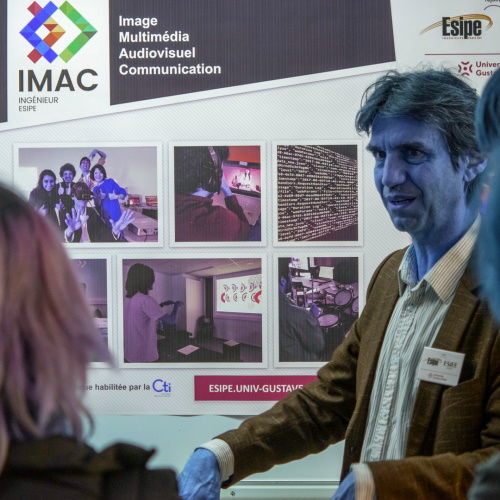

## ⭐ Noir & Blanc

Pour chaque pixel, on calcule la luminance et on la transforme en nuance de gris.

## ⭐ Négatif

Pour chaque pixel, on remplace chaque channel de couleur `x` par `1 - x`.

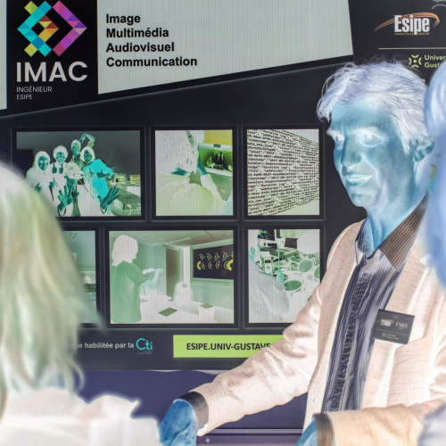

## ⭐ Dégradé

Pour chaque pixel, on calcule son niveau de gris en fonction de son abcisse `x` : `x/(image.width() - 1)`

## ⭐⭐ Miroir

On remplace chaque pixel de position `(x, y)` par le pixel `(image.width() - x -1, y)`.

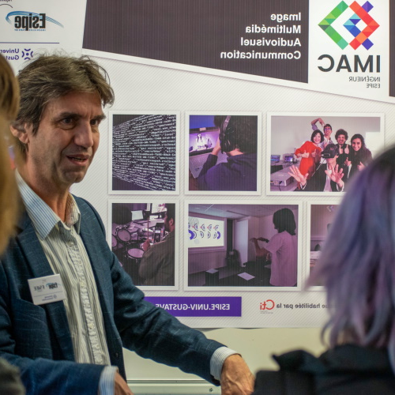

## ⭐⭐ Image bruitée

Pour chaque pixel, on a une probabilité `noise_level` de le remplacer par une couleur aléatoire.

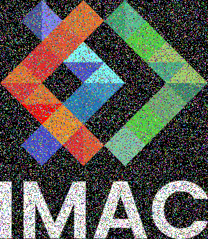

## ⭐⭐ Rotation de 90°

On créé une nouvelle image de dimensions `(image.height(), image.width())` où chaque pixel de position `(x, y)` copie le pixel `(y, image.height() - x -1)` de l'image originale.

## ⭐⭐ RGB split

On définit un décalage `offset`.
Pour chaque pixel de position `(x, y)`, on remplace le channel rouge par celui du pixel de position `(x - offset, y)` et le channel rouge par celui du pixel de position `(x + offset, y)`.

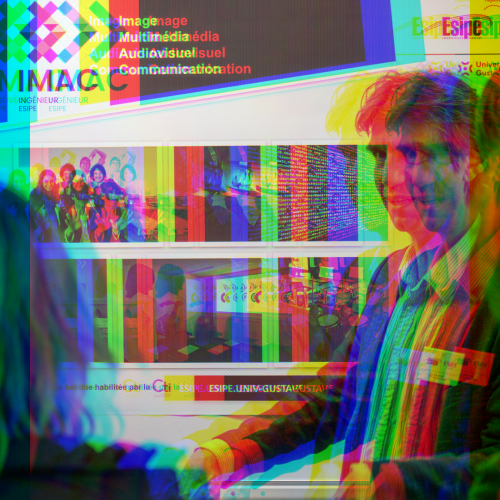

## ⭐⭐ Luminosité

On met chaque channel de chaque pixel la puissance `pow(2, increase)`.
||  |  |  | |  |
|-|-|-|-|-|-|
|`increase`|-1|-0.5|0|0.5|1| 

## ⭐⭐(⭐) Disque

Chaque pixel dont la distance au centre du disque est inférieure au rayon du disque est blanc, les autres sont noirs.

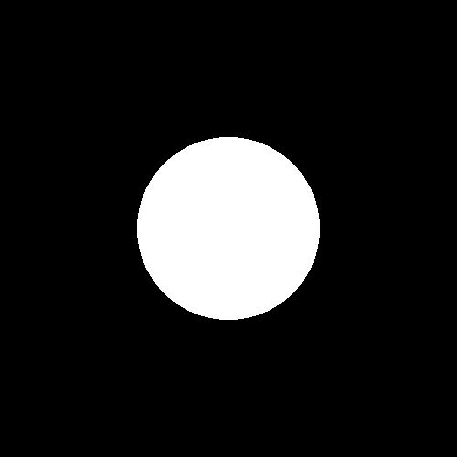

### ⭐ Cercle

Chaque pixel dont l'écart entre la distance au centre du disque et le rayon du disque est inférieur à la moitié de l'épaisseur est blanc, les autres sont noirs.

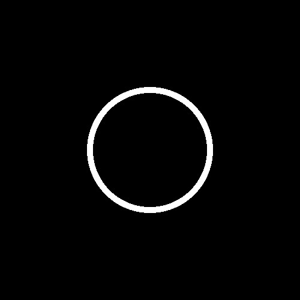

### ⭐⭐ Animation

On fait une boucle en décalant le disque d'une certaine valeur à chaque itération et on exporte chaque version.

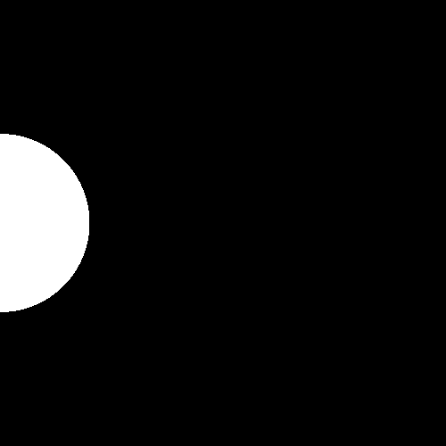

### ⭐⭐⭐ Rosace

On fait un cercle au centre, puis on créé 6 cercles : chacun est positionné sur le rayon et on utilise cosinus et sinus pour calculer leur position selon un angle que l'on augment de 60 degrés à chaque nouveau cercle.

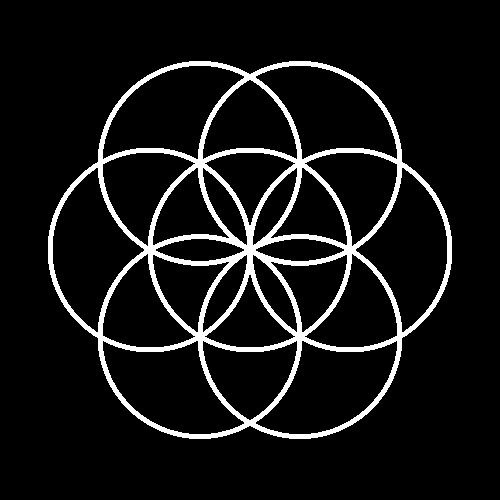

## ⭐⭐ Mosaïque

On définit un nombre de division par ligne `n_divisions`.
On définit une largeur et une hauteur de portion de la mosaïque `division_width = image.width()/n_divisions` et `division_height = image.height()/n_divisions`.
On remplace chaque pixel de position `(x, y)` par le pixel de position `((x%division_width)*n_divisions, (y%division_height)*n_divisions)`.

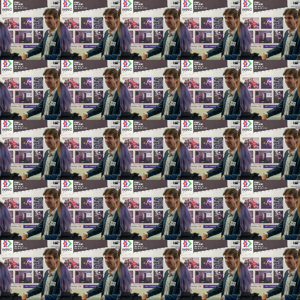

### ⭐⭐⭐⭐ Mosaïque miroir

On fait pareil qu'avant, mais on inverse l'abcisse du pixel que l'on copie si `(x/division_width)%2 == 0` et on inverse l'ordonnée si `(y/division_height)%2 == 0`.

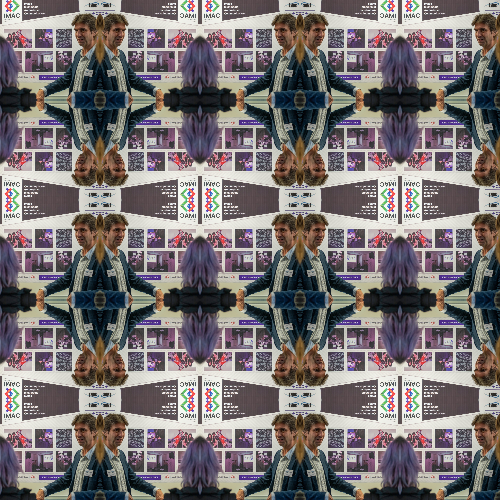

## ⭐⭐⭐ Glitch

On échange un certain nombre de fois 2 rectangles de pixels aléatoires, en s'assurant à chaque fois que les rectangles ne dépassent pas de l'image.

## ⭐⭐⭐ Tri de pixels

On trie le tableau de l'image selon la luminance :

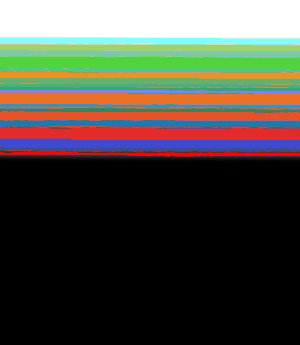

On "divise" le tableau en différentes portions qui correspondent chacune à une ligne et on trie chaque portion séparément.

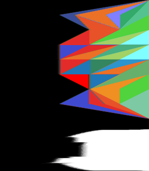

## ⭐⭐⭐ Dégradés dans l'espace de couleur Lab

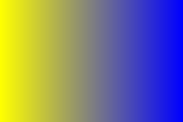

(Pas fini)

## ⭐⭐⭐(⭐) Fractale de Mandelbrot

## ⭐⭐⭐(⭐) Tramage

## ⭐⭐⭐(⭐) Normalisation de l'histogramme

On calcule les luminances minimales (`min_bri`) et maximales (`max_bri`) de l'image, puis on soustrait `min_bri` à chaque couleur et on les divise par `max_bri - min_bri`.

## ⭐⭐⭐⭐ Vortex

On définit une intensité de rotation `intensity`.
Pour chaque pixel de position `(x, y)`, on calcule la `distance` entre celui-ci et le centre, puis on le remplace par le pixel le plus proche de sa position tournée de `distance * intensity` autour du centre. (Si la position sort de l'image, on met du noir.)

|| 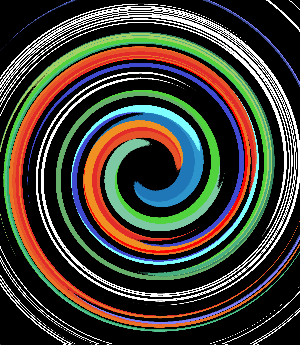 |  | 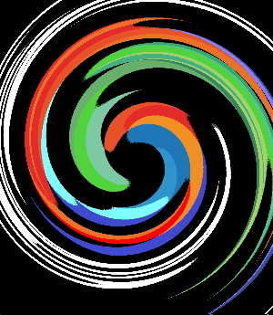 | 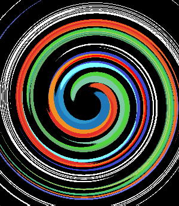 |
|-|-|-|-|-|
|`intensity`|-0.1|-0.05|0.05|0.1|

## ⭐⭐⭐⭐ Convolutions

J'ai implémenté la version du programme où les bords sont calculés comme si les pixels en dehors de l'image étaient une copie du pixel le plus proche dans l'image (d'où l'effet bizarre sur les bords pour certaines images).

||  |  |
|-|-|-|
|`offset`|1 (3x3)|10 (21x21)|

### ⭐ Netteté, Contours, etc.

J'ai repris le même code qu'avant, mais en créant d'autres kernels.

|  | 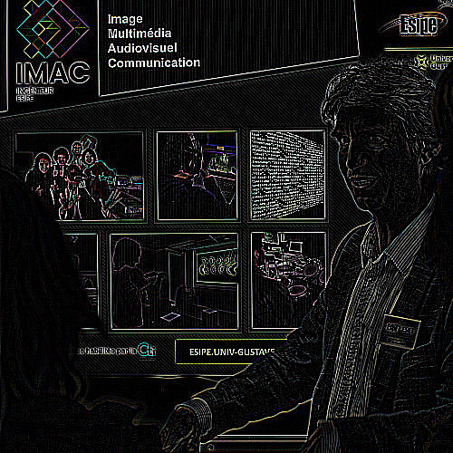 |  |
|-|-|-|
|Emboss|Outline|Sharpen|

### ⭐⭐ Filtres séparables

J'ai combiné des fonctions précédentes pour programmer cette version du box blur.

||  |  | 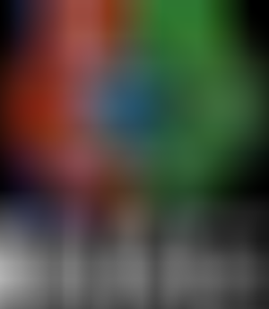 |
|-|-|-|-|
|`offset`|1 (3x3)|10 (21x21)| 50 (101x101)|

### ⭐⭐ Différence de gaussiennes

Selon les paramètres que l'on prend, on peut avoir des tonnes de résultats différents.

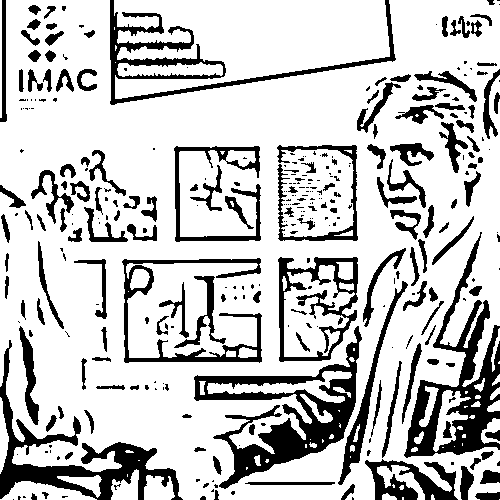

## ⭐⭐⭐⭐⭐ K-means : trouver les couleurs les plus présentes dans une image

Bizarrement, les couleurs ne sont pas réparties exactement pareil que dans l'exemple.

|  |  |  | |
|-|-|-|-|
|Originale|2 couleurs|3 couleurs|16 couleurs|

## ⭐⭐⭐⭐⭐ Filtre de Kuwahara (effet peinture à l'huile)

L'effet est un peu différent de l'exemple aussi.

||  |  |
|-|-|-|
|`offset`|2|5|

## ⭐⭐⭐⭐⭐⭐ Diamond Square

### ⭐⭐ Colorer la height map
